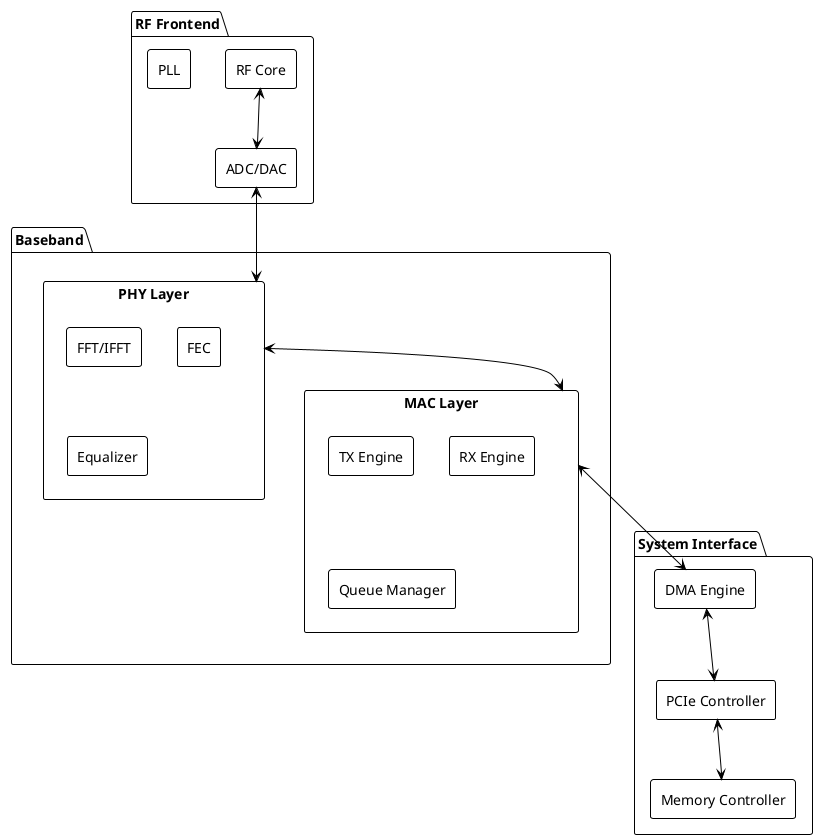
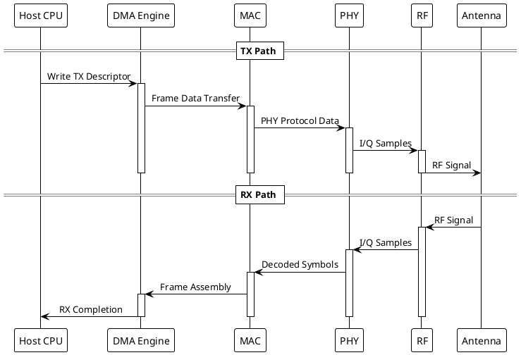
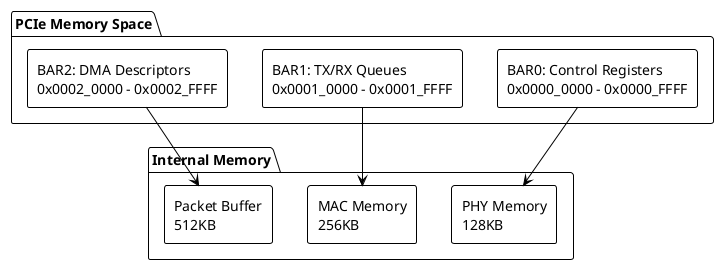

# Advanced Wi-Fi 6E/7 Linux Driver Implementation

High-performance Linux kernel driver for next-generation Wi-Fi 6E/7 devices with advanced features including MLO (Multi-Link Operation), 320MHz channels, and 4K QAM support.

## Hardware Architecture 


## Signal Processing Pipeline


## Memory Architecture


## Build Requirements

- Linux Kernel Headers (≥ 6.1)
- GCC (≥ 12.0)
- CMake (≥ 3.25)
- libnl3
- crypto++ development headers

## Installation
### Install dependencies on Arch Linux 
```bash 
sudo pacman -S base-devel linux-headers cmake libnl crypto++
```
## Build 
```bash 
make 
sudo make install 
```


## Testing

Hardware testing requires specialized RF testing equipment:
- Vector Signal Analyzer
- Spectrum Analyzer (>7GHz capability)
- RF Shield Box